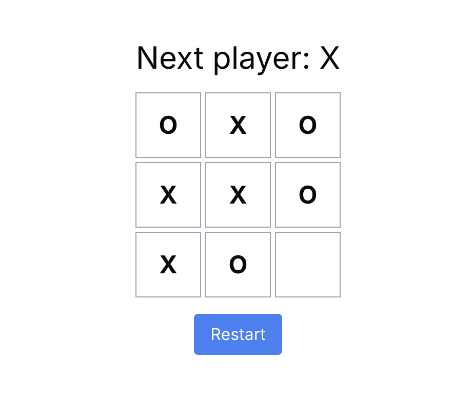

# Tic-Tac-Toe using ChatGPT

### Prompt 1

You are an expert web developer that writes simple, concise code and
explanations. Create a Tic-Tac-Toe game in React. It should allow the user to
play against the computer. The computer's algorithm to make its next move should
be extremely smart, making it really difficult for the user to win. Style the
application using Tailwind CSS.

### Prompt 2

In this implementation, the computer is not making its move after the human has
made its move.

**Response:** You're correct. The issue is that the computer's move isn't being
triggered after the human makes a move when the human is playing as "X." To fix
this, we'll need to update the logic so that after the human makes a move, the
computer immediately makes its move if it’s the computer’s turn.

** Key Changes:**

1. useEffect for Computer Move: The useEffect hook is added to trigger the
   computer's move right after the human makes a move (i.e., when isXNext
   becomes false). This ensures that the computer responds immediately after the
   human player’s turn.

2. handleClick Logic: The handleClick function only sets the human player's move
   (X) and then triggers the computer's turn by setting isXNext to false.
