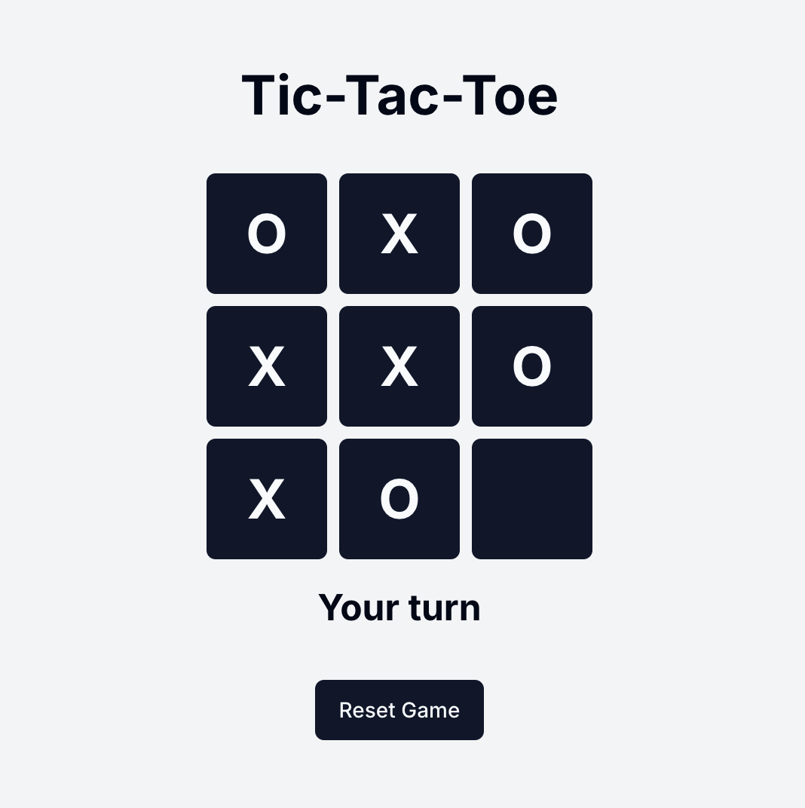

# Tic Tac Toe Claude

The above screenshot is from a fully working app in Claude's environment. This
feature is called a Claude artifact.

I tried the same prompts a second time to see if Claude would generate the same
code. While not exact, it was very similar. In fact, I like the look of this new
version 2. Also it got rid of the alert dialog at the end of the game, which
means that I can see the end state of the board very clearly.

### Prompt

1. Create a Tic-Tac-Toe game in React. It should allow the user to play against
   the computer.
2. The computer's algorithm for making the next move seems to be extremely dumb.
   Can you make that algorithm extremely smart so that it gives a tough
   competition to the user?

**Claude:** You're absolutely right. The current algorithm for the computer's
move is indeed very basic, just choosing a random empty square. Let's improve it
to make the computer a formidable opponent. We'll implement the Minimax
algorithm, which is a decision-making algorithm commonly used in two-player
games like Tic-Tac-Toe. This will make the computer play optimally, making it
very difficult for the user to win.

### Conclusion

1. Claude produced an excellent result in just two prompts. Not only does the
   game look aesthetically pleasing, it is hard to beat.
2. The generated code was JavaScript, which took a little effort to run with
   Typescript.
