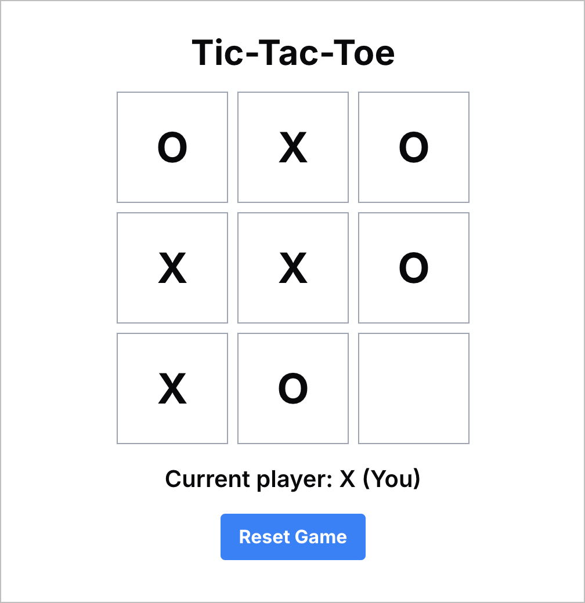

# Tic Tac Toe using Cursor

## Approach 1 – Prioritize working result in minimum number of prompts

1. Implement a Tic-Tac-Toe game in React. It should allow the user to play
   against the computer. Use Tailwind CSS for styling the game.
2. The computer's algorithm for making the next move seems to be extremely dumb.
   Can you make that algorithm extremely smart so that it gives a tough
   competition to the user?
3. Can you fix the board layout so that the column gap does not increase when
   the window width is increased. Make the column gap the same as the row gap.
   Also center the whole layout on the window.

## Approach 2 – Prioritize type safety and clean code

1. Update the component to play the Tic-Tac-Toe game – computer vs. human. Style
   the component using Tailwind CSS.
2. Fix the syntax error in the computerMove function
3. Now fix the TypeScript errors
4. There are more ESLint and TypeScript errors. Fix them.
5. Instead of null, use undefined to set a square that is empty
6. Fix error with the `for` loop: "Expected a `for-of` loop instead of a `for`
   loop with this simple iteration."
7. The algorithm to make the computer move is extremely dumb. Fix it to so that
   it gives a tough fight to the human.
8. Human is still able to win easily. Can you use the minimax algorithm to make
   sure computer gives a tough fight?
9. Can you move the logic for the computer move outside the component. The
   component should only maintain the board state and isHumanTurn.
10. Adjust the layout so that the board is always a square. Currently gap
    between the columns increases as the widow width is increased. I'd like to
    fix the size of the board and center it on the screen.
11. The height of a blank row seems to be less than the height of a filled row.
    Make sure that all row hights are equal regardless of their content.

This approach resulted in type-safe code much faster. I didn't even attempt it
with other AIs due to the slow iterations in their environments. Additionally,
the code was cleaner and more maintainable because the game logic was moved
outside the component.
