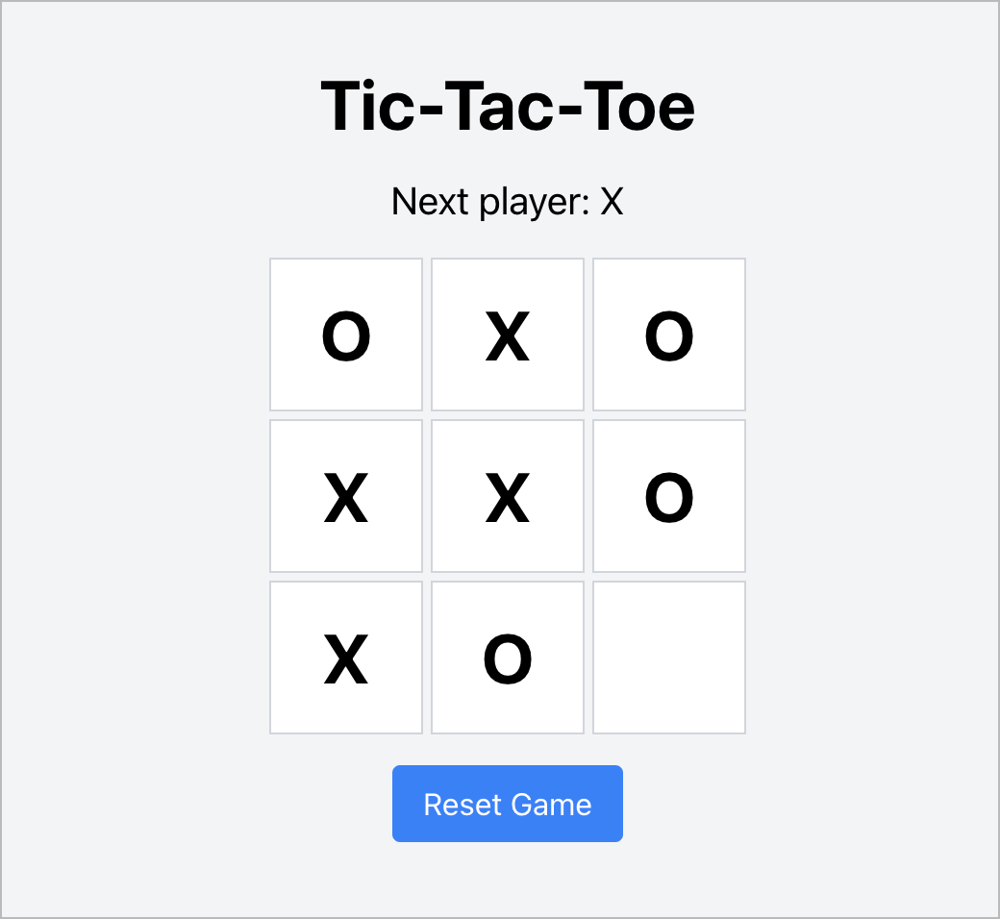

# Tic-Tac-Toe using Devin

It took 2 prompts to get the logic right!

### Prompt 1

Create a Tic-Tac-Toe game in React. It should allow the user to play against the
computer. Use Tailwind CSS to style the application.

### Prompt 2

The algorithm for computing the computer's next move is extremely dumb. Can you
make that algorithm smart so that it gives a tough competition to the user?

**Response**

I understand that you're looking for a more challenging opponent in the
Tic-Tac-Toe game. Improving the computer's move algorithm to make smarter
decisions is definitely possible. I'll work on implementing a more advanced
algorithm like minimax to enhance the computer's gameplay. I'll get started on
this and update you once I have made progress. Thank you for the feedback!

The Tic-Tac-Toe game in React has been successfully enhanced with a smarter
computer opponent using the minimax algorithm.
