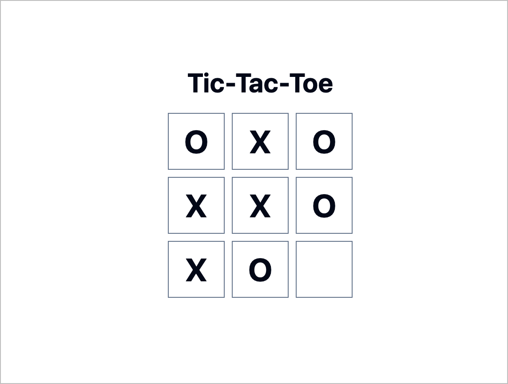

# Tic-Tac-Toe using v0

It took x prompts to get the logic right!

### Prompt 1

A Tic-Tac-Toe game that allows the user to play against the computer

### Prompt 2

Add a title "Tic-Tac-Toe"

### Prompt 3

Make the borders of the squares a bit darker so that they are visible

### Prompt 4

When the user plays its turn (player X), make the computer play its turn
automatically.

### Prompt 5

The algorithm for computing the computer's next move is extremely dumb. Can you
make that algorithm smart so that it gives a tough competition to the user?

### Prompt 6

The app does not detect when the game is over and announce it immediately.
Please fix this.

### Prompt 7

Still not fixed. Check the case when the computer makes a move and wins. No
announcement is made and the game is allowed to continue.

### Prompt 8

The "Play Again" button should be horizontally centered

### Prompt 9 (failed)

When the game result is announced and "Play Again" button is shown, the content
shifts up. Can you prevent that by simply hiding those components when not
necessary, but keeping space for them?

> v0 was not able to follow this prompt
